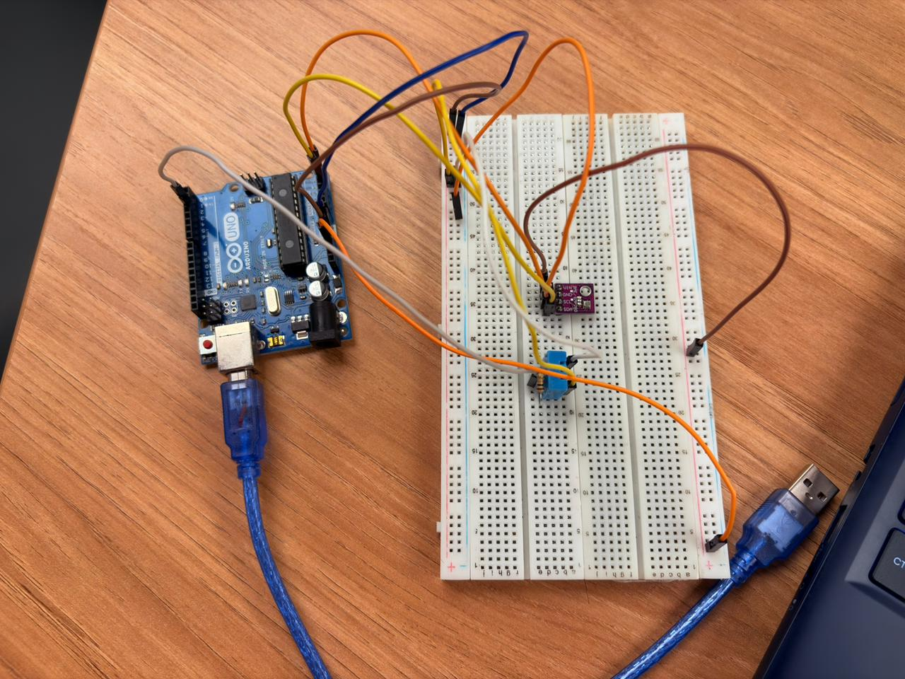

# Estação Meteorológica IoT

Este projeto é um sistema completo de uma Estação Metereológica, ele coleta dados através de um Arduino UNO, processa e armazena essas informações em um banco de dados (SQLite) via backend  e exibe tudo em tempo real em um Dashboard interativo feito em React

## Tecnologias Utilizadas
* **Hardware:** Arduino Uno, Sensor DHT11 (Temperatura e Umidade), Sensor BMP280 (Pressão).
* **Backend:** Python, Flask, Flask-CORS, PySerial, SQLite.
* **Frontend:** React, Vite, Tailwind CSS.

## Pré-requisitos
Antes de começar, certifique-se de ter instalado em sua máquina:
* [Python](https://www.python.org/downloads/)
* [Node.js e npm](https://nodejs.org/)
* [Arduino IDE](https://www.arduino.cc/en/software)

## Como instalar

### 1. Configurar o Backend
Abra um terminal na pasta backend:

```bash
    cd backend

    #Crie um ambiente virtual 
    py -m venv venv

    # Ative o ambiente virtual
    # No Windows:
    venv\Scripts\activate
    # No Linux/Mac:
    source venv/bin/activate

    # Instale as dependências
    pip -r requirements.txt
```

### 2. Configurar o Frontend

```bash
    cd frontend

    # Instale as dependências do Node
    npm install
```


## Como executar
projeto precisa ser executado em três etapas independentes:

### 1. Hardware (Arduino)

- Conecte o Arduino ao computador via USB.

- Abra o arquivo .ino na Arduino IDE.

- Certifique-se de ter as bibliotecas DHT sensor library e Adafruit BMP280 Library instaladas.

- Faça o upload do código para a placa.

- IMPORTANTE: Feche o Serial Monitor (Monitor Serial) da IDE após verificar se está funcionando, para liberar a porta USB para o Python.

### 2. Servidor Backend

Com o ambiente virtual ativado no terminal da pasta backend, inicie o servidor Flask:

```bash
    py app.py
```

Em um novo terminal (também com o venv ativado e na pasta backend), inicie o script que lê a porta serial do Arduino e envia para o banco de dados:

```bash
python serial_reader.py
```

* **Detalhe:** Caso não possua o hardware, há um modo para injetar dados, basta realizar as intruções dentro do código desse mesmo arquivo e mudar o valor de uma variável de False para True

### 3. Servidor Frontend

No terminal da pasta frontend, inicie a aplicação React:

```bash
    npm run dev
```

## Descrição das Rotas da API (Backend)

A API RESTful construída em Flask expõe os seguintes endpoints:

| Método | Rota | Descrição |
|---|---| --- |
| GET | / | Retorna as 10 últimas leituras cadastradas |
| GET| /leituras | Lista leituras com suporte a paginação (aceita os parâmetros ?page= e ?limite=) |
| POST |/leituras | Cria uma nova leitura. Requer um JSON com temperatura e umidade |
| GET | /leituras/<id> | Retorna os detalhes de uma leitura específica buscando pelo seu ID |
| PUT | /leituras/<id> | Atualiza os dados de uma leitura existente. Requer JSON com os dados novos | 
| DELETE | /leituras/<id> | Remove uma leitura específica do banco de dados |
| GET | /api/estatisticas | Retorna os valores agregados: média, mínima e máxima para temperatura e umidade | 


## Estrutura do Banco de dados (SQLite)
A tabela leituras possui a seguinte estrutura:

- id (INTEGER, Primary Key)
- temperatura (REAL, Not Null)
- umidade (REAL, Not Null)
- pressao (REAL)
- localizacao (TEXT, Default 'Lab')
- timestamp (DATETIME, Default 'now')

## Foto do Hardware
